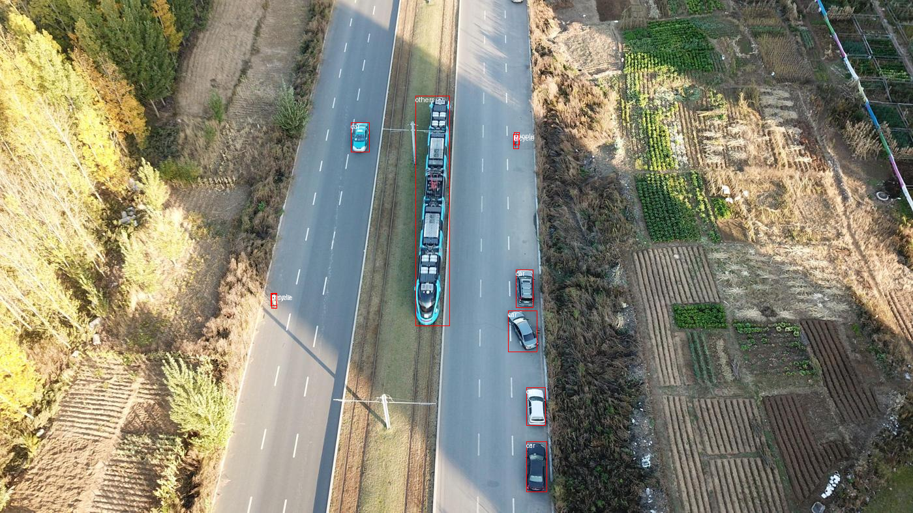

# Benchmarking DINO for Drone-View Object Detection on VisDrone 🚁

[](https://www.python.org/downloads/)
[](https://pytorch.org/)
[](https://opensource.org/licenses/MIT)

> **CSE 429: Computer Vision and Pattern Recognition - Final Project**

<p align="center">
  

  
  <br>
  <em>Figure 1: Comparison of CNN-based NMS (left) vs. Transformer-based Bipartite Matching (right) in hyper-dense UAV scenarios.</em>
</p>

## 📖 Abstract
The rapid proliferation of Unmanned Aerial Vehicles (UAVs) demands robust, high-precision aerial object detection. However, standard architectures struggle with extreme scale variations, high object density, and severe background clutter. In this project, we implement and benchmark **DINO (DETR with Improved DeNoising Anchor Boxes)** against the industry-standard **YOLOv11** and a vanilla **DETR** baseline on the challenging VisDrone-DET2019 dataset. 

Our findings validate the efficacy of Contrastive DeNoising (CDN) and anchor-free transformer logic in overcoming bipartite matching instability for small-scale targets, while revealing critical trade-offs in edge deployment viability.

---

## 🧠 Approach & Architecture

Standard detectors rely on dense anchor placement and Non-Maximum Suppression (NMS), which creates bottlenecks in crowded drone imagery. We bypass this using DINO, leveraging three core pillars:

1. **Contrastive DeNoising (CDN):** Injects positive and negative samples during training to stabilize bipartite matching and eliminate duplicate predictions without NMS.
2. **Mixed Query Selection:** Initializes positional queries dynamically from multi-scale encoder features rather than static priors, accelerating convergence on varied drone perspectives.
3. **Look Forward Twice:** A novel gradient refinement mechanism that allows deeper decoder layers to correct the bounding box coordinates of earlier layers, critical for localizing sub-15x15 pixel targets.

<p align="center">
  
  <br>
  <em>Figure 2: Our evaluation pipeline and the core components of the DINO architecture.</em>
</p>

---

## 📊 Quantitative Results

Models were evaluated on the VisDrone validation split using an NVIDIA T4 GPU. 

| Model | mAP@0.5 | mAP@0.5:0.95 | Inference Speed (FPS) | Complexity (GFLOPs) |
| :--- | :---: | :---: | :---: | :---: |
| **YOLOv11 (Baseline)** | `[ 0.00 ]` | `[ 0.00 ]` | `[ 00.0 ]` | `[ 00.0 ]` |
| **Vanilla DETR** | `0.081` | `0.034` | `25` | `86` |
| **DINO (Proposed)** | `[ 0.00 ]` | `[ 0.00 ]` | `[ 00.0 ]` | `[ 00.0 ]` |

**Key Takeaways:**
* **Ablation Insight:** Disabling CDN resulted in a `[XX]%` drop in early-epoch mAP, highlighting its role as a powerful surrogate for NMS in dense clusters.
* **Edge Deployment:** While DINO achieved superior bounding box precision, its quadratic cross-attention complexity heavily limits its FPS. YOLOv11 remains the pragmatic choice for SWaP-constrained (Size, Weight, and Power) real-time UAV flight.

---

## 👁️ Qualitative Analysis

<p align="center">
  
  <br>
  <em>Figure 3: Top row displays success cases (crowd handling, small object recovery). Bottom row displays failure cases (low-light ghosting, sub-5x5 pixel misses).</em>
</p>

DINO excels in hyper-dense pedestrian plazas, successfully mapping distinct queries to heavily overlapping targets where YOLO's NMS aggressively merges them. Conversely, DINO occasionally lacks the localized inductive biases of CNNs, leading to false positives under low-light conditions by mistaking structural shadows for small vehicles.

---

## 🚀 Reproduction & Setup

### 1. Environment Installation
```bash
git clone [https://github.com/tasbeeh04/DINO_DETR_UAV_Applications.git](https://github.com/tasbeeh04/DINO_DETR_UAV_Applications.git)
cd DINO_DETR_UAV_Applications
pip install -r requirements.txt

```

### 2. Dataset Preparation

VisDrone utilizes a custom text format. We provide a script to parse these annotations into the PyTorch COCO-evaluator format required by DINO.

```bash
# Place raw VisDrone data in datasets/VisDrone/
python scripts/visdrone_to_coco.py --input datasets/VisDrone/annotations --output datasets/VisDrone/coco_format.json

```

### 3. Training & Inference

Due to extreme memory constraints of multi-scale transformers, we recommend executing our provided notebooks on Kaggle (minimum 16GB VRAM required).

* `notebooks/YOLO_DINO_Training.ipynb`
* `notebooks/DETR_Training.ipynb`

---

## 👥 Team

**Egypt-Japan University of Science and Technology (E-JUST)**

* Jana Mohamed Elsalhy
* Shiref Ashraf Mohamed
* Ahmed Nagah Ramadan
* Tasbih Othman Neamatallah
* Karim Yaser Mazroua
* Yasmeen Sameh Mohamed

**Instructor:** Prof. Ahmed Gomaa

---

## 📚 References

* [Vision Meets Drones: A Challenge (Zhu et al.)](https://arxiv.org/abs/1804.07437)
* [DINO: DETR with Improved DeNoising Anchor Boxes (Zhang et al.)](https://arxiv.org/abs/2203.03605)

```

```
